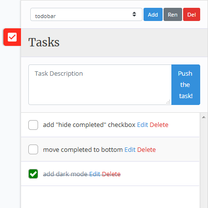
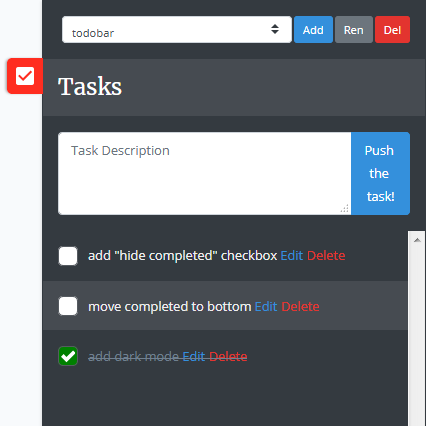

# Laravel TodoBar

TodoBar creates an overlay right sidebar to ease your Laravel projects task management.

- It stores the tasks in a JSON file which is located in `/resources/todobar` folder, which is shared among your code in your repository, so you can get the tasks on every platform that you are developing your project.

- It supports multiple groups, which you can use to track different aspects of your project in a single file, and you can easily switch between groups with a single dropdown.

- It uses Bootstrap components as the frontend library, and for the "Edit Task" modal.
<br><br>

## Preview
*Classic Mode*


<br><br>
*Dark Mode (Will be available in next versions)*


<br><br>


## Installation
You can install the package via composer with:

```
composer require tpaksu/laravel-todobar --dev
```

The sidebar will be enabled by default, but you can disable it by adding

    TODOBAR_ENABLED=false

to your environment variables and run `php artisan config:cache` to update the configuration cache.
<br><br>


## Package Contents

This package publishes the views used in the package and a configuration file which consists of three settings:

- **enabled**: Enables the sidebar by setting the environment variable (`TODOBAR_ENABLED`) in your `.env` file, or by changing the default value when the environment value is missing.

- **start_visible**: Defines the visibility on page load, if you set it to true, the sidebar will be shown on page load.

- **overlay**: Defines if the sidebar will cover some part of the web page (overlay), or shrink the page and display the whole page besides itself.

- **dark_mode**: Defines if the interface will use the dark theme. (Not yet implemented)

- **storage**: Defines the used storage class to store the tasks. Currently supports one `JSONStorage` driver. Can be extended. See [**Extending**](#extending) below.

### .Vue Files

The files are located in:

    +- tpaksu/laravel-todobar/src
      +- resources
        +- assets
        |   +- todobar.scss         Global SCSS file
        |- components
        |   +- form.vue             Contains the `add new task` form component
        |   |- handle.vue           Contains the todobar drawer handle component
        |   |- loader.vue           Contains the loader overlay
        |   |- modal.vue            Contains the `edit task` modal component
        |   |- panel.vue            Contains the todobar container
        |   |- projects.vue         Contains the project select and buttons
        |   +- tasks.vue            Contains the task list
        |-- App.vue                 The main entry file
        +-- eventbus.js             EventBus module for communicating between components

After compilation with `npm run build` these files will be created:

    +- tpaksu/laravel-todobar/dist
      +- app.css                    Compiled CSS file
      |- app.js                     Compiled user code files
      |- chunk-vendors.js           Compiled vendor files
      +- index.html                 Test page


## Extending

The package contains a `Storage` folder which contains an interface `DataStorageInterface` defining the data storage provider repository, and an example `JSONStorage` class which handles the data persisting in JSON file. If you want to use something different than a JSON file to store your tasks, you can create a class implementing `DataStorageInterface` and make the package use that instead by changing the configuration like this:

```php
    "storage" => [
        "engine" => \App\TodoBar\CustomStorage::class,
        "params" => [
            "param" => "[ Passed to your class ]",
        ],
    ],
```

<br><br>

## Contributing

You are always welcome to send pull requests to this package. Please describe why and what changed in the code, so I can approve them quickly.
<br><br>

## Security
If you discover any security related issues, please email tpaksu@gmail.com directly instead of using the issue tracker.
<br><br>

## License
The MIT License (MIT).
